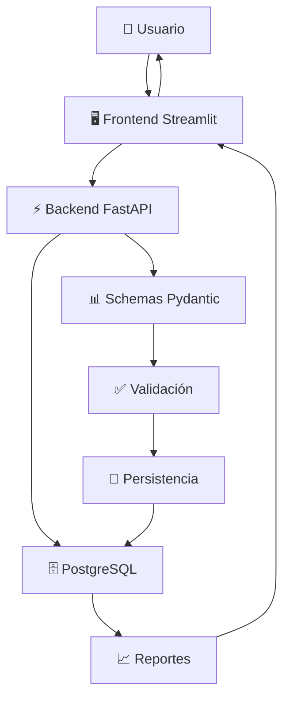

# 💰 Sistema Contable Empresarial

Un sistema de contabilidad completo y modular desarrollado con FastAPI (backend), Streamlit (frontend), y PostgreSQL (base de datos). Sistema integral que cubre todo el ciclo contable con 12 módulos especializados.

## 🚀 Características Principales

- **Backend Robusto**: FastAPI con SQLAlchemy, PostgreSQL y arquitectura modular
- **Frontend Intuitivo**: Streamlit con interfaz web responsive y navegación fluida
- **Base de Datos**: PostgreSQL 17.5 con pgAdmin para administración
- **Sistema Completo**: 12 módulos integrados que cubren todo el ciclo contable
- **Jerarquías Contables**: Catálogo de cuentas con niveles automáticos y visualización jerárquica
- **Dockerizado**: Despliegue completo con Docker Compose y configuración de contenedores
- **APIs RESTful**: Documentación automática con OpenAPI/Swagger
- **Reportes Avanzados**: Sistema de reportes de ventas con gráficos y análisis

## 📊 Módulos del Sistema

### 🏢 Módulos Contables Principales

1. **📋 Catálogo de Cuentas** - Gestión jerárquica de cuentas contables
2. **📖 Manual de Cuentas** - Documentación y descripción de cuentas
3. **✍️ Libro Diario (Asientos)** - Registro de asientos contables con validación de partida doble
4. **📊 Transacciones** - Gestión de operaciones comerciales
5. **📅 Períodos Contables** - Administración de ejercicios fiscales
6. **📈 Reportes** - Generación de reportes contables y exportación

### 💰 Módulos de Gestión Financiera

7. **⚖️ Balanza de Comprobación** - Verificación de saldos contables
8. **💵 Balance Inicial** - Configuración de saldos de apertura
9. **🔧 Partidas de Ajuste** - Ajustes contables de fin de período
10. **📊 Estados Financieros** - Balance General y Estado de Resultados

### 🛒 Módulos de Facturación y Ventas

11. **🧾 Facturación Digital** - Sistema completo de facturación
12. **📈 Reportes de Ventas** - Dashboard y análisis de ventas con visualizaciones

## 🛠️ Instalación y Configuración

### Prerrequisitos

- Docker Desktop (versión 4.0 o superior)
- Git
- 4GB RAM disponible (recomendado)
- Puertos libres: 8000, 8501, 5432, 5050

### 1. Clonar el repositorio

```bash
git clone https://github.com/mm23047/App-Ciclo-contable.git
cd App-Ciclo-contable
```

### 2. Configurar variables de entorno

El archivo `.env` ya está configurado con valores por defecto funcionales:

```bash
# Variables principales (ya configuradas)
PORT_BE=8000              # Puerto del backend
PORT_FE=8501              # Puerto del frontend
POSTGRES_USER=postgres    # Usuario de PostgreSQL
POSTGRES_PASSWORD=abc123  # Contraseña de PostgreSQL
POSTGRES_DB=zapateria     # Nombre de la base de datos
```

### 3. Levantar los servicios

```bash
# Construir y ejecutar todos los contenedores
docker-compose up --build

# O en segundo plano
docker-compose up -d --build
```

### 4. Verificar servicios

Espera a que todos los contenedores estén saludables:

- ✅ `sistema_contable_db` (PostgreSQL)
- ✅ `sistema_contable_backend` (FastAPI)
- ✅ `sistema_contable_frontend` (Streamlit)
- ✅ `sistema_contable_pgadmin` (pgAdmin)

## 🌐 Acceso al Sistema

Una vez que todos los servicios estén ejecutándose:

- **🖥️ Frontend (Streamlit)**: http://localhost:8501
- **⚡ Backend API (FastAPI)**: http://localhost:8000
- **📚 Documentación API**: http://localhost:8000/docs
- **🛠️ pgAdmin**: http://localhost:5050 (admin@admin.com / admin)

## ✨ Nuevas Funcionalidades Implementadas

### 🏗️ Sistema de Jerarquías Contables

- **Cálculo automático de niveles**: Los niveles jerárquicos se calculan automáticamente basados en cuentas padre
- **Visualización mejorada**: Indentación visual con símbolos `└─` para mostrar la estructura jerárquica
- **Selección flexible**: Cualquier cuenta puede ser padre de otra (no solo cuentas de agrupación)
- **Información detallada**: Muestra tipo de cuenta (Grupo/Detalle) en la selección de cuentas padre

### 🔧 Resolución Completa de Conectividad

- **Nombres de contenedores consistentes**: Configuración correcta en docker-compose.yml
- **Importaciones optimizadas**: Sistema robusto de carga condicional de módulos
- **Manejo de errores**: Los módulos con problemas se omiten automáticamente sin afectar el sistema
- **Schemas sincronizados**: Todos los campos coinciden entre backend y frontend

### 📊 Sistema de Reportes de Ventas Avanzado

- **Dashboard interactivo**: Visualización de métricas con gráficos dinámicos
- **Análisis comparativo**: Comparación entre períodos con tendencias
- **Filtros inteligentes**: Selección de fechas con claves únicas para evitar conflictos
- **Exportación múltiple**: Generación de reportes en diferentes formatos

### 🛡️ Validaciones y Consistencia de Datos

- **Campos estandarizados**: Uso consistente de `estado` en lugar de `estado_cuenta`
- **IDs únicos**: Elementos de interfaz con claves únicas para evitar conflictos
- **Validaciones de integridad**: Verificación de cuentas padre existentes
- **Manejo de errores robusto**: Sistema tolerante a fallos parciales

## 📖 Guía de Uso Rápida

### 1. 🏢 Gestión de Catálogo de Cuentas

- **Crear cuenta raíz**: Sin cuenta padre (Nivel 1)
- **Crear subcuentas**: Seleccionar cuenta padre existente (Nivel N+1)
- **Visualizar jerarquía**: Ver estructura con indentación automática
- **Gestionar estados**: Activar/Inactivar cuentas según necesidad

### 2. 📖 Manual de Cuentas

- **Documentar cuentas**: Agregar descripciones y políticas contables
- **Asociar a cuentas activas**: Solo se muestran cuentas en estado ACTIVA
- **Editar información**: Modificar descripciones según evolución del negocio

### 3. ✍️ Asientos Contables

- **Crear transacciones**: Registrar operaciones comerciales por período
- **Generar asientos**: Asociar cuentas con débitos y créditos
- **Validar partida doble**: Sistema automático de validación contable

### 4. 📈 Reportes de Ventas

- **Dashboard general**: Métricas principales con filtros de período
- **Análisis detallado**: Reportes por cliente, producto y período
- **Comparativo**: Análisis entre dos períodos diferentes
- **Top performers**: Mejores clientes y productos del período

## 🏗️ Arquitectura del Sistema

```
App-Ciclo-contable/
├── 🔧 BE/                          # Backend FastAPI
│   ├── app/
│   │   ├── main.py                 # Aplicación principal con carga condicional
│   │   ├── db.py                   # Configuración de PostgreSQL
│   │   ├── 🗃️ models/              # 12 Modelos SQLAlchemy
│   │   │   ├── catalogo_cuentas.py # Modelo con jerarquías
│   │   │   ├── manual_cuentas.py
│   │   │   ├── asiento.py
│   │   │   ├── transaccion.py
│   │   │   ├── balanza_comprobacion.py
│   │   │   └── ...                 # 7 modelos adicionales
│   │   ├── 📋 schemas/             # Esquemas Pydantic validados
│   │   ├── 🛣️ routes/              # 12 Routers con prefijos /api/
│   │   └── ⚙️ services/            # Lógica de negocio con validaciones
│   ├── requirements.txt            # Dependencias del backend
│   └── Dockerfile                  # Imagen optimizada Python 3.11
├── 🖥️ FE/                          # Frontend Streamlit
│   ├── app.py                      # Aplicación principal con navegación
│   ├── 📄 modules/                 # 12 Módulos de interfaz
│   │   ├── catalogo_cuentas.py     # Con visualización jerárquica
│   │   ├── manual_cuentas.py       # Documentación de cuentas
│   │   ├── reportes_ventas.py      # Dashboard avanzado
│   │   └── ...                     # 9 módulos adicionales
│   ├── requirements.txt            # Dependencias del frontend
│   └── Dockerfile                  # Imagen Streamlit optimizada
├── 🐳 docker-compose.yml           # Orquestación de 4 servicios
├── 🔐 .env                         # Variables de entorno configuradas
├── 📝 .gitignore                   # Exclusiones optimizadas
└── 📖 README.md                    # Documentación completa
```

## ⚙️ Servicios Docker

| Servicio        | Contenedor                  | Puerto | Descripción                      |
| --------------- | --------------------------- | ------ | -------------------------------- |
| 🗄️ **postgres** | `sistema_contable_db`       | 5432   | PostgreSQL 17.5 con BD zapateria |
| ⚡ **backend**  | `sistema_contable_backend`  | 8000   | FastAPI con 12 módulos           |
| 🖥️ **frontend** | `sistema_contable_frontend` | 8501   | Streamlit con navegación         |
| 🛠️ **pgadmin**  | `sistema_contable_pgadmin`  | 5050   | Administración de BD             |

## 🔄 Flujo de Datos



## 🛠️ Desarrollo y Comandos Útiles

### Comandos Docker Esenciales

```bash
# Verificar estado de contenedores
docker ps

# Ver logs de un servicio específico
docker logs sistema_contable_backend --tail 20
docker logs sistema_contable_frontend --tail 20

# Reconstruir solo un servicio
docker-compose up --build backend -d
docker-compose up --build frontend -d

# Parar todos los servicios
docker-compose down

# Parar y limpiar volúmenes
docker-compose down -v
```

### Desarrollo Local (Opcional)

#### Backend FastAPI

```bash
cd BE
pip install -r requirements.txt
uvicorn app.main:app --host 0.0.0.0 --port 8000 --reload
```

#### Frontend Streamlit

```bash
cd FE
pip install -r requirements.txt
streamlit run app.py --server.port 8501
```

### Base de Datos

```bash
# Conectar a PostgreSQL directamente
docker exec -it sistema_contable_db psql -U postgres -d zapateria

# Backup de la base de datos
docker exec sistema_contable_db pg_dump -U postgres zapateria > backup.sql

# Restaurar backup
cat backup.sql | docker exec -i sistema_contable_db psql -U postgres -d zapateria
```

## 🧪 API Testing

### Endpoints Principales

```bash
# Verificar salud del backend
curl http://localhost:8000/health

# Listar cuentas del catálogo
curl http://localhost:8000/api/catalogo-cuentas

# Crear nueva cuenta
curl -X POST "http://localhost:8000/api/catalogo-cuentas" \
     -H "Content-Type: application/json" \
     -d '{
       "codigo_cuenta": "1000",
       "nombre_cuenta": "ACTIVOS",
       "tipo_cuenta": "Activo",
       "acepta_movimientos": false,
       "estado": "ACTIVA"
     }'

# Ver documentación interactiva
# Abrir: http://localhost:8000/docs
```

## 🔍 Troubleshooting

### Problemas Comunes

#### ❌ Error: "Connection refused"

```bash
# Verificar que todos los contenedores estén running
docker ps

# Reconstruir backend si hay problemas
docker-compose up --build backend -d
```

#### ❌ Error: "KeyError en frontend"

```bash
# Verificar logs del frontend
docker logs sistema_contable_frontend --tail 50

# Reconstruir frontend
docker-compose up --build frontend -d
```

#### ❌ Error: "Database connection"

```bash
# Verificar PostgreSQL
docker logs sistema_contable_db --tail 20

# Reiniciar base de datos
docker-compose restart db17
```

## 📝 Contribución y Desarrollo

### Estructura del Proyecto

```
proyecto-contable/
├── BE/                     # Backend FastAPI
│   ├── app/
│   │   ├── main.py        # Aplicación principal
│   │   ├── db.py          # Configuración de base de datos
│   │   ├── models/        # Modelos SQLAlchemy
│   │   ├── routes/        # Rutas de la API
│   │   ├── schemas/       # Esquemas Pydantic
│   │   └── services/      # Lógica de negocio
│   ├── requirements.txt
│   └── Dockerfile
├── FE/                     # Frontend Streamlit
│   ├── app.py             # Aplicación principal
│   ├── modules/           # Módulos de la interfaz
│   ├── requirements.txt
│   └── Dockerfile
├── tests/                  # Pruebas automatizadas
│   ├── be/                # Tests del backend
│   └── fe/                # Tests del frontend
├── docker-compose.yml      # Orquestación de servicios
└── README.md
```

### Reglas de Contribución

1. **Crear branch** desde main para nuevas características
2. **Seguir convenciones** de nombres de archivos y variables
3. **Documentar cambios** en commits y pull requests
4. **Ejecutar tests** antes de hacer merge

### Testing

```bash
# Ejecutar tests del backend
cd tests/be
python -m pytest test_*.py -v

# Tests específicos
python -m pytest test_asientos.py::test_crear_asiento -v
```

## 📞 Soporte

Para reportar bugs o solicitar nuevas características:

1. **Crear issue** en el repositorio
2. **Incluir logs** relevantes y pasos para reproducir
3. **Especificar versión** del sistema operativo y Docker

### Logs Importantes

```bash
# Logs completos del sistema
docker-compose logs

# Logs específicos por timeframe
docker logs sistema_contable_backend --since 1h
docker logs sistema_contable_frontend --since 30m
```

## 🎯 Roadmap

### Próximas Características

- [ ] **Autenticación y roles** de usuario
- [ ] **Respaldos automatizados** de base de datos
- [ ] **Notificaciones** por email
- [ ] **Exportación** a formatos adicionales (Excel, PDF)
- [ ] **Dashboard analytics** avanzado
- [ ] **API móvil** para consultas rápidas

### Mejoras Técnicas

- [ ] **Tests unitarios** completos (>80% coverage)
- [ ] **CI/CD pipeline** con GitHub Actions
- [ ] **Containerización** optimizada
- [ ] **Monitoreo** con Prometheus/Grafana
- [ ] **Cache Redis** para mejor performance

---

**Desarrollado para gestión contable empresarial** 🏢  
**Stack**: FastAPI + Streamlit + PostgreSQL + Docker  
**Licencia**: MIT 3. **Editar/Eliminar** → Modifica transacciones y asientos según sea necesario 4. **Generar Reportes** → Visualiza y exporta el Libro Diario

### Pasos Detallados

#### 1. Gestión de Transacciones

- Navega a la página "Transacciones"
- Llena el formulario con fecha, descripción, tipo (INGRESO/EGRESO), usuario, etc.
- Al crear exitosamente, la transacción queda seleccionada para asientos

#### 2. Gestión de Asientos

- Navega a la página "Asientos" (solo disponible con transacción seleccionada)
- Selecciona una cuenta del catálogo
- Especifica si es Débito o Crédito y el monto
- El sistema valida que exactamente uno de debe/haber sea > 0

#### 3. Reportes y Exportación

- Navega a la página "Reportes"
- Visualiza el Libro Diario con todos los asientos
- Exporta en formato Excel o HTML
- Revisa balances por período

## 🔧 API Examples

### Crear Transacción

```bash
curl -X POST "http://localhost:8000/api/transacciones/" \
     -H "Content-Type: application/json" \
     -d '{
       "fecha_transaccion": "2025-08-01T10:00:00",
       "descripcion": "Venta de camisetas",
       "tipo": "INGRESO",
       "moneda": "USD",
       "usuario_creacion": "estudiante1",
       "id_periodo": 1
     }'
```

**Respuesta 201:**

```json
{
  "id_transaccion": 12
}
```

### Crear Asiento

```bash
curl -X POST "http://localhost:8000/api/asientos/" \
     -H "Content-Type: application/json" \
     -d '{
       "id_transaccion": 12,
       "id_cuenta": 3,
       "debe": 50.00,
       "haber": 0.00
     }'
```

**Respuesta 201:**

```json
{
  "id_asiento": 45
}
```

## 📋 Validaciones y Reglas de Negocio

### Transacciones

- Fecha debe ser formato ISO válido
- Tipo debe ser 'INGRESO' o 'EGRESO'
- Descripción y usuario son obligatorios

### Asientos

- Debe existir la transacción asociada (FK validation)
- Debe existir la cuenta asociada (FK validation)
- **Regla crítica**: Exactamente uno de `debe` o `haber` debe ser > 0
- No se permite crear asientos sin transacción

### Eliminación

- **TODO**: Definir política de cascada al eliminar transacciones
- Actualmente implementa eliminación en cascada
- Considerar marcar como inactivo en lugar de eliminar

## 🧪 Desarrollo

### Ejecutar Backend Localmente

```bash
cd BE
pip install -r requirements.txt
uvicorn app.main:app --host 0.0.0.0 --port 8000 --reload
```

### Ejecutar Frontend Localmente

```bash
cd FE
pip install -r requirements.txt
streamlit run app.py --server.port 8501
```

### Ejecutar Pruebas

```bash
# TODO: Implementar framework de pruebas
python -m pytest tests/
```

## 🐛 Tareas Pendientes (TODO)

### Backend

- [ ] Implementar Alembic para migraciones en producción
- [ ] Configurar gunicorn/uvicorn workers para producción
- [ ] Implementar paginación para endpoints con muchos registros
- [ ] Añadir autenticación y autorización
- [ ] Mejorar manejo de errores con logs estructurados
- [ ] Implementar políticas de eliminación en cascada configurables

### Frontend

- [ ] Cargar períodos dinámicamente desde la API
- [ ] Implementar validaciones client-side más robustas
- [ ] Añadir gráficos y dashboards
- [ ] Implementar filtros avanzados en reportes
- [ ] Mejorar UX con loading states y confirmaciones

### General

- [ ] Configurar CI/CD pipeline
- [ ] Implementar backup automatizado de la base de datos
- [ ] Documentar API con ejemplos más detallados
- [ ] Añadir métricas y monitoreo
- [ ] Configurar CORS específicos para producción

## 📚 Tecnologías Utilizadas

- **Backend**: FastAPI, SQLAlchemy, psycopg2-binary, Pydantic
- **Frontend**: Streamlit, Requests, Pandas
- **Base de datos**: PostgreSQL 17.5
- **Administración DB**: pgAdmin 4
- **Containerización**: Docker, Docker Compose
- **Exportación**: openpyxl (Excel), Jinja2 (HTML)

## 🔒 Configuración de Producción

### Variables de Entorno Importantes

```bash
# En producción, usar valores seguros:
POSTGRES_PASSWORD=<contraseña-fuerte>
PGADMIN_PASSWORD=<contraseña-fuerte>

# Configurar CORS específicos
ALLOWED_ORIGINS=https://tu-dominio.com

# Configurar SSL para bases de datos
DATABASE_SSL=require
```

### Consideraciones de Seguridad

- Cambiar todas las contraseñas por defecto
- Configurar HTTPS/SSL para todos los servicios
- Implementar rate limiting en la API
- Configurar firewalls y acceso restringido a puertos
- Usar secretos de Docker/Kubernetes en lugar de .env

## 🤝 Contribución

1. Fork el proyecto
2. Crea una rama feature (`git checkout -b feature/nueva-funcionalidad`)
3. Commit tus cambios (`git commit -am 'Añadir nueva funcionalidad'`)
4. Push a la rama (`git push origin feature/nueva-funcionalidad`)
5. Abre un Pull Request

### Gitflow

- `main`: Código de producción estable
- `develop`: Rama de desarrollo principal
- `feature/*`: Nuevas funcionalidades
- `release/*`: Preparación de releases
- `hotfix/*`: Correcciones urgentes

## 📞 Soporte

Para reportar bugs o solicitar funcionalidades, por favor abre un issue en el repositorio.

---
