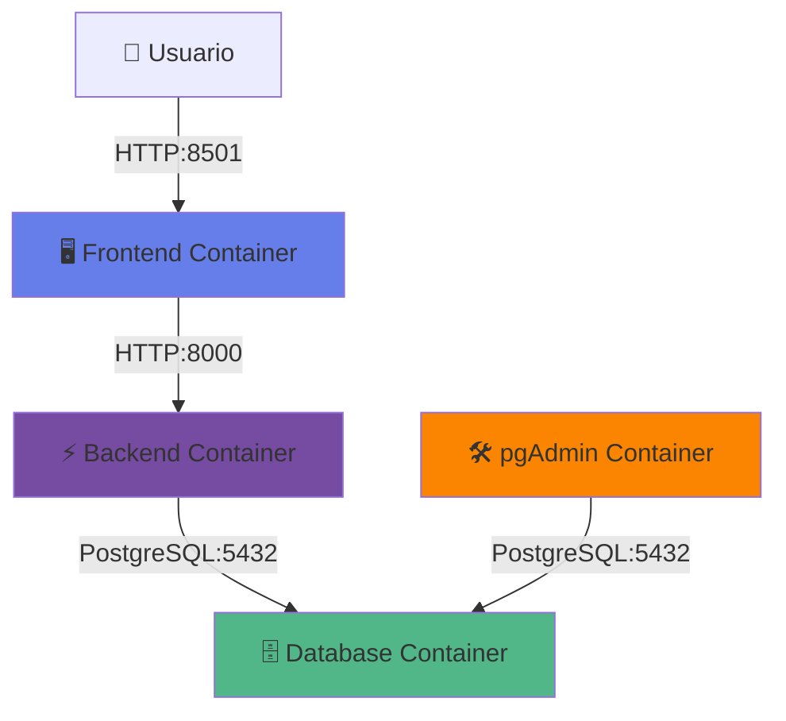
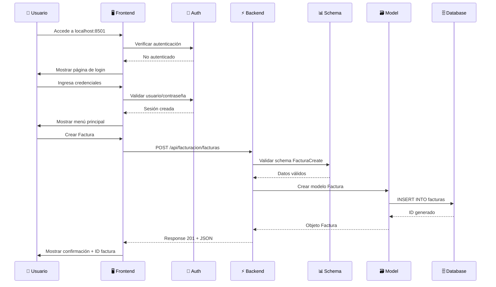

# 💰 Sistema Contable Empresarial

Un sistema de contabilidad completo y modular desarrollado con **FastAPI** (backend), **Streamlit** (frontend), y **PostgreSQL** (base de datos). Sistema integral que cubre todo el ciclo contable con **15 módulos especializados** incluyendo facturación digital y autenticación.

## 🚀 Características Principales

- **🔐 Sistema de Autenticación**: Login seguro con gestión de sesiones y roles de usuario
- **Backend Robusto**: FastAPI con SQLAlchemy, PostgreSQL y arquitectura modular
- **Frontend Intuitivo**: Streamlit con interfaz web responsive y navegación fluida
- **Base de Datos**: PostgreSQL 17.5 con pgAdmin para administración
- **Sistema Completo**: 15 módulos integrados que cubren todo el ciclo contable
- **Facturación Digital**: Sistema completo de facturación con gestión de productos, clientes y reportes
- **Reportes Avanzados**: Dashboard de ventas con análisis por período, gráficos interactivos y exportación PDF/Excel
- **Jerarquías Contables**: Catálogo de cuentas con niveles automáticos y visualización jerárquica
- **Dockerizado**: Despliegue completo con Docker Compose (4 contenedores)
- **APIs RESTful**: Documentación automática con OpenAPI/Swagger

## 📋 Tabla de Contenidos

1. [Requisitos Previos](#-requisitos-previos)
2. [Instalación Paso a Paso](#-instalación-paso-a-paso)
3. [Módulos del Sistema](#-módulos-del-sistema)
4. [Acceso al Sistema](#-acceso-al-sistema)
5. [Tecnologías Utilizadas](#-stack-tecnológico)
6. [Arquitectura](#-arquitectura-del-sistema)
7. [Migraciones de Base de Datos](#-migraciones-de-base-de-datos)
8. [Comandos Útiles](#-comandos-útiles)
9. [Troubleshooting](#-troubleshooting)

---

## 📦 Requisitos Previos

Antes de comenzar, asegúrate de tener instalado:

### Requisitos Obligatorios

| Software | Versión Mínima | Descarga |
|----------|----------------|----------|
| **Docker Desktop** | 4.0+ | [https://www.docker.com/products/docker-desktop](https://www.docker.com/products/docker-desktop) |
| **Git** | 2.30+ | [https://git-scm.com/downloads](https://git-scm.com/downloads) |

### Requisitos de Sistema

- **Sistema Operativo**: Windows 10/11 (64-bit), macOS 10.15+, o Linux
- **RAM**: Mínimo 4GB disponible (recomendado 8GB)
- **Espacio en Disco**: Mínimo 5GB libres
- **Puertos Disponibles**: 5432, 5050, 8000, 8501

### Verificar Instalación

```bash
# Verificar Docker
docker --version
# Salida esperada: Docker version 24.0.0 o superior

# Verificar Docker Compose
docker-compose --version
# Salida esperada: Docker Compose version 2.0.0 o superior

# Verificar Git
git --version
# Salida esperada: git version 2.30.0 o superior
```

---

## 🚀 Instalación Paso a Paso

### Opción 1: Clonar desde GitHub (Recomendado)

#### Paso 1: Clonar el Repositorio

Abre una terminal (PowerShell en Windows, Terminal en macOS/Linux) y ejecuta:

```bash
# Clonar el repositorio
git clone https://github.com/mm23047/App-Ciclo-contable.git

# Entrar al directorio del proyecto
cd App-Ciclo-contable
```

#### Paso 2: Verificar Estructura del Proyecto

```bash
# Listar archivos (Windows PowerShell)
dir

# Listar archivos (macOS/Linux o Git Bash)
ls -la
```

Deberías ver esta estructura:

```
App-Ciclo-contable/
├── BE/                      # Backend FastAPI
├── FE/                      # Frontend Streamlit
├── tests/                   # Pruebas
├── .env                     # Variables de entorno
├── .gitignore              
├── docker-compose.yml       # Orquestación Docker
└── README.md
```

### Opción 2: Descargar ZIP desde GitHub

#### Paso 1: Descargar el Archivo ZIP

1. Ve a [https://github.com/mm23047/App-Ciclo-contable](https://github.com/mm23047/App-Ciclo-contable)
2. Haz clic en el botón verde **"Code"**
3. Selecciona **"Download ZIP"**
4. Guarda el archivo en tu computadora

#### Paso 2: Extraer y Preparar

```bash
# Windows PowerShell
Expand-Archive -Path App-Ciclo-contable-main.zip -DestinationPath C:\Proyectos\
cd C:\Proyectos\App-Ciclo-contable-main

# macOS/Linux
unzip App-Ciclo-contable-main.zip
cd App-Ciclo-contable-main
```

### Paso 3: Configurar Variables de Entorno

El archivo `.env` ya viene configurado con valores por defecto funcionales. **No necesitas modificarlo** para una instalación básica.

```bash
# Ver contenido del archivo .env (opcional)
cat .env
```

**Contenido del archivo `.env`:**

```env
# Puertos de los servicios
PORT_BE=8000              # Puerto del backend FastAPI
PORT_FE=8501              # Puerto del frontend Streamlit

# Configuración de PostgreSQL
POSTGRES_USER=postgres    # Usuario de la base de datos
POSTGRES_PASSWORD=abc123  # Contraseña de PostgreSQL
POSTGRES_DB=zapateria     # Nombre de la base de datos
POSTGRES_HOST=localhost   
POSTGRES_PORT=5432        # Puerto de PostgreSQL

# Configuración de pgAdmin
PGADMIN_EMAIL=admin@admin.com
PGADMIN_PASSWORD=abc123
PGADMIN_PORT=5050

# API Key para LLM (opcional)
LLM_API_KEY=
```

> **⚠️ Importante para Producción**: Cambia las contraseñas antes de desplegar en un entorno real.

### Paso 4: Construir y Levantar los Contenedores

Este es el paso más importante. Docker descargará todas las imágenes necesarias y construirá los contenedores.

```bash
# Construir y levantar todos los servicios
docker-compose up --build -d
```

**Explicación del comando:**
- `docker-compose`: Herramienta para orquestar múltiples contenedores
- `up`: Inicia los servicios
- `--build`: Construye las imágenes desde cero
- `-d`: Ejecuta en segundo plano (detached mode)

**Salida esperada:**

```
[+] Building 45.2s (24/24) FINISHED
[+] Running 5/5
 ✔ Network app-ciclo-contable_default       Created
 ✔ Volume "app-ciclo-contable_postgres17_data" Created
 ✔ Container sistema_contable_db            Started
 ✔ Container sistema_contable_backend       Started
 ✔ Container sistema_contable_frontend      Started
 ✔ Container sistema_contable_pgadmin       Started
```

### Paso 5: Verificar que los Contenedores Estén Running

```bash
# Ver estado de los contenedores
docker ps
```

**Salida esperada:**

```
CONTAINER ID   IMAGE                    STATUS         PORTS                    NAMES
abc123def456   app-ciclo-contable-frontend   Up 2 minutes   0.0.0.0:8501->8501/tcp   sistema_contable_frontend
def456ghi789   app-ciclo-contable-backend    Up 2 minutes   0.0.0.0:8000->8000/tcp   sistema_contable_backend
ghi789jkl012   dpage/pgadmin4           Up 2 minutes   0.0.0.0:5050->5050/tcp   sistema_contable_pgadmin
jkl012mno345   postgres:17.5-alpine     Up 2 minutes   0.0.0.0:5432->5432/tcp   sistema_contable_db
```

✅ Todos los contenedores deben mostrar **STATUS: Up**

### Paso 6: Esperar a que la Base de Datos Esté Lista

El backend espera automáticamente a que PostgreSQL esté completamente inicializado (configurado en `docker-compose.yml` con `healthcheck`).

```bash
# Ver logs del backend para confirmar conexión exitosa
docker logs sistema_contable_backend --tail 20
```

**Busca esta línea en los logs:**

```
INFO:     Application startup complete.
INFO:     Uvicorn running on http://0.0.0.0:8000
```

### Paso 7: Verificar Acceso Web

Abre tu navegador y verifica cada servicio:

1. **Frontend (Streamlit)**: [http://localhost:8501](http://localhost:8501)
   - Deberías ver la página de **Inicio de Sesión**
   
2. **Backend (FastAPI)**: [http://localhost:8000/docs](http://localhost:8000/docs)
   - Deberías ver la documentación interactiva de la API (Swagger UI)
   
3. **pgAdmin**: [http://localhost:5050](http://localhost:5050)
   - Usuario: `admin@admin.com`
   - Contraseña: `abc123`

### Paso 8: Iniciar Sesión en el Sistema

En la página de login ([http://localhost:8501](http://localhost:8501)), usa estas credenciales:

**Credenciales de Demostración:**

| Usuario | Contraseña | Rol |
|---------|-----------|-----|
| `admin` | `admin123` | Administrador |
| `contador` | `contador123` | Contador |
| `usuario` | `usuario123` | Usuario |

> 💡 **Recomendación**: Usa el usuario `admin` para tener acceso completo a todos los módulos.

---

## 🎉 ¡Instalación Completada!

Si llegaste hasta aquí y todos los pasos funcionaron correctamente, **¡felicidades!** 🎊

Tu sistema contable está funcionando en:
- 🖥️ **Frontend**: [http://localhost:8501](http://localhost:8501)
- ⚡ **API Backend**: [http://localhost:8000/docs](http://localhost:8000/docs)
- 🛠️ **pgAdmin**: [http://localhost:5050](http://localhost:5050)

---

## 📊 Módulos del Sistema

El sistema cuenta con **15 módulos especializados** organizados en 4 categorías principales:

### 🏗️ Módulos de Configuración

1. **📋 Catálogo de Cuentas** - Gestión jerárquica de cuentas contables con niveles automáticos
2. **📖 Manual de Cuentas** - Documentación y descripción detallada de cada cuenta
3. **⚖️ Balance Inicial** - Configuración de saldos de apertura del período contable

### 📝 Módulos de Operaciones Contables

4. **💰 Transacciones** - Gestión de operaciones comerciales y financieras
5. **✍️ Asientos Contables** - Registro de asientos con validación de partida doble
6. **🔧 Partidas de Ajuste** - Ajustes contables de fin de período

### 🧾 Módulos de Facturación y Ventas

7. **🧾 Facturación Digital** - Sistema completo de facturación con retenciones fiscales
8. **👥 Gestión de Clientes** - Administración de cartera de clientes
9. **📦 Gestión de Productos** - Catálogo de productos y servicios con inventario
10. **📊 Reportes de Ventas** - Dashboard avanzado con análisis por período, gráficos interactivos, exportación PDF/Excel/CSV

### 📊 Módulos de Reportes y Consultas

11. **📚 Libro Mayor** - Movimientos de cada cuenta contable
12. **📋 Libro Diario** - Registro cronológico de todas las transacciones
13. **⚖️ Balanza de Comprobación** - Verificación de saldos contables
14. **💼 Estados Financieros** - Balance General y Estado de Resultados automáticos
15. **📅 Gestión de Períodos** - Administración de ejercicios fiscales y cierres contables

---

## 🌐 Acceso al Sistema

Una vez que todos los contenedores estén ejecutándose correctamente:

| Servicio | URL | Credenciales | Descripción |
|----------|-----|--------------|-------------|
| **🖥️ Frontend** | [http://localhost:8501](http://localhost:8501) | `admin` / `admin123` | Interfaz principal del sistema |
| **⚡ API Backend** | [http://localhost:8000](http://localhost:8000) | N/A | Servidor de aplicaciones |
| **📚 Documentación API** | [http://localhost:8000/docs](http://localhost:8000/docs) | N/A | Swagger UI interactivo |
| **🛠️ pgAdmin** | [http://localhost:5050](http://localhost:5050) | `admin@admin.com` / `abc123` | Administrador de base de datos |
| **🗄️ PostgreSQL** | `localhost:5432` | `postgres` / `abc123` | Base de datos (requiere cliente SQL) |

### Usuarios del Sistema

| Usuario | Contraseña | Rol | Permisos |
|---------|-----------|-----|----------|
| `admin` | `admin123` | Administrador | Acceso completo a todos los módulos |
| `contador` | `contador123` | Contador | Acceso a módulos contables y reportes |
| `usuario` | `usuario123` | Usuario | Acceso limitado a consultas |

---

## 🛠️ Stack Tecnológico

### Backend (BE/)

| Tecnología | Versión | Propósito |
|------------|---------|-----------|
| **Python** | 3.11 | Lenguaje de programación |
| **FastAPI** | Latest | Framework web moderno y rápido |
| **Uvicorn** | Latest | Servidor ASGI de alto rendimiento |
| **SQLAlchemy** | Latest | ORM para manejo de base de datos |
| **Pydantic** | Latest | Validación de datos y schemas |
| **psycopg2-binary** | Latest | Adaptador PostgreSQL para Python |
| **Pandas** | Latest | Análisis y manipulación de datos |
| **Jinja2** | Latest | Motor de plantillas para reportes |
| **OpenPyXL** | Latest | Generación de archivos Excel |

### Frontend (FE/)

| Tecnología | Versión | Propósito |
|------------|---------|-----------|
| **Streamlit** | Latest | Framework para interfaces web interactivas |
| **Requests** | Latest | Cliente HTTP para consumir API backend |
| **Pandas** | Latest | Manipulación de DataFrames |
| **Plotly** | Latest | Gráficos interactivos y visualizaciones |
| **ReportLab** | Latest | Generación de archivos PDF |
| **OpenPyXL** | Latest | Exportación a Excel |

### Infraestructura

| Componente | Versión | Propósito |
|------------|---------|-----------|
| **PostgreSQL** | 17.5-alpine | Base de datos relacional |
| **pgAdmin 4** | Latest | Administrador web de PostgreSQL |
| **Docker** | 4.0+ | Containerización de aplicaciones |
| **Docker Compose** | 2.0+ | Orquestación de contenedores |

### Arquitectura de Contenedores



---

## 🔄 Migraciones de Base de Datos

### ⚠️ Importante: Después de hacer `git pull`

Si tu compañero o cualquier desarrollador hace `git pull` y obtiene **error 500 en crear factura** o en cualquier módulo, es porque faltan columnas en la base de datos.

### Migración de Retenciones Fiscales (22/11/2024)

Ejecuta este comando para agregar las columnas de retenciones:

```bash
docker exec -it sistema_contable_db psql -U postgres -d zapateria -c "
ALTER TABLE facturas 
ADD COLUMN IF NOT EXISTS retencion_fuente NUMERIC(15,2) DEFAULT 0.00,
ADD COLUMN IF NOT EXISTS reteica NUMERIC(15,2) DEFAULT 0.00;
"
```

### Verificar Base de Datos Actualizada

```bash
# Verificar que las columnas existan
docker exec -it sistema_contable_db psql -U postgres -d zapateria -c "\d facturas"
```

### Script Completo de Actualización

Si tu compañero tiene problemas, que ejecute estos comandos en orden:

```bash
# 1. Hacer pull de los cambios
git pull origin main

# 2. Agregar columnas faltantes (si aplica)
docker exec -it sistema_contable_db psql -U postgres -d zapateria -c "
ALTER TABLE facturas 
ADD COLUMN IF NOT EXISTS retencion_fuente NUMERIC(15,2) DEFAULT 0.00,
ADD COLUMN IF NOT EXISTS reteica NUMERIC(15,2) DEFAULT 0.00;
"

# 3. Reconstruir contenedores con código actualizado
docker-compose up -d --build

# 4. Verificar que todo funcione
curl http://localhost:8000/health
```

### 📋 Historial de Migraciones

| Fecha | Descripción | Comando |
|-------|-------------|---------|
| 22/11/2024 | Agregar retenciones fiscales | `ALTER TABLE facturas ADD COLUMN retencion_fuente, reteica` |

## 💡 Notas para el Equipo

- **Siempre ejecuta migraciones** después de hacer `git pull`
- **Revisa esta sección** si obtienes errores 500 inesperados
- **Documenta nuevas migraciones** en la tabla de arriba cuando agregues cambios al esquema

### 4. Verificar servicios

Espera a que todos los contenedores estén saludables:

- ✅ `sistema_contable_db` (PostgreSQL)
- ✅ `sistema_contable_backend` (FastAPI)
- ✅ `sistema_contable_frontend` (Streamlit)
- ✅ `sistema_contable_pgadmin` (pgAdmin)

## 🌐 Acceso al Sistema

Una vez que todos los servicios estén ejecutándose:

- **🖥️ Frontend (Streamlit)**: http://localhost:8501
- **⚡ Backend API (FastAPI)**: http://localhost:8000
- **📚 Documentación API**: http://localhost:8000/docs
- **🛠️ pgAdmin**: http://localhost:5050 (admin@admin.com / admin)

## ✨ Nuevas Funcionalidades Implementadas

### 🏗️ Sistema de Jerarquías Contables

- **Cálculo automático de niveles**: Los niveles jerárquicos se calculan automáticamente basados en cuentas padre
- **Visualización mejorada**: Indentación visual con símbolos `└─` para mostrar la estructura jerárquica
- **Selección flexible**: Cualquier cuenta puede ser padre de otra (no solo cuentas de agrupación)
- **Información detallada**: Muestra tipo de cuenta (Grupo/Detalle) en la selección de cuentas padre

### 🔧 Resolución Completa de Conectividad

- **Nombres de contenedores consistentes**: Configuración correcta en docker-compose.yml
- **Importaciones optimizadas**: Sistema robusto de carga condicional de módulos
- **Manejo de errores**: Los módulos con problemas se omiten automáticamente sin afectar el sistema
- **Schemas sincronizados**: Todos los campos coinciden entre backend y frontend

### 📊 Sistema de Reportes de Ventas Avanzado

- **Dashboard interactivo**: Visualización de métricas con gráficos dinámicos
- **Análisis comparativo**: Comparación entre períodos con tendencias
- **Filtros inteligentes**: Selección de fechas con claves únicas para evitar conflictos
- **Exportación múltiple**: Generación de reportes en diferentes formatos

### 🛡️ Validaciones y Consistencia de Datos

- **Campos estandarizados**: Uso consistente de `estado` en lugar de `estado_cuenta`
- **IDs únicos**: Elementos de interfaz con claves únicas para evitar conflictos
- **Validaciones de integridad**: Verificación de cuentas padre existentes
- **Manejo de errores robusto**: Sistema tolerante a fallos parciales

## 📖 Guía de Uso Rápida

### 1. 🏢 Gestión de Catálogo de Cuentas

- **Crear cuenta raíz**: Sin cuenta padre (Nivel 1)
- **Crear subcuentas**: Seleccionar cuenta padre existente (Nivel N+1)
- **Visualizar jerarquía**: Ver estructura con indentación automática
- **Gestionar estados**: Activar/Inactivar cuentas según necesidad

### 2. 📖 Manual de Cuentas

- **Documentar cuentas**: Agregar descripciones y políticas contables
- **Asociar a cuentas activas**: Solo se muestran cuentas en estado ACTIVA
- **Editar información**: Modificar descripciones según evolución del negocio

### 3. ✍️ Asientos Contables

- **Crear transacciones**: Registrar operaciones comerciales por período
- **Generar asientos**: Asociar cuentas con débitos y créditos
- **Validar partida doble**: Sistema automático de validación contable

### 4. 📈 Reportes de Ventas

- **Dashboard general**: Métricas principales con filtros de período
- **Análisis detallado**: Reportes por cliente, producto y período
- **Comparativo**: Análisis entre dos períodos diferentes
- **Top performers**: Mejores clientes y productos del período

## 🏗️ Arquitectura del Sistema

### Estructura de Directorios

```
App-Ciclo-contable/
├── 🔧 BE/                          # Backend FastAPI
│   ├── app/
│   │   ├── main.py                 # Aplicación principal con carga de módulos
│   │   ├── db.py                   # Configuración de PostgreSQL y SQLAlchemy
│   │   ├── 🗃️ models/              # 15 Modelos SQLAlchemy (tablas de BD)
│   │   │   ├── catalogo_cuentas.py # Cuentas contables con jerarquías
│   │   │   ├── manual_cuentas.py   # Documentación de cuentas
│   │   │   ├── asiento.py          # Asientos contables
│   │   │   ├── transaccion.py      # Transacciones comerciales
│   │   │   ├── facturacion.py      # Facturas y retenciones
│   │   │   ├── balanza_comprobacion.py
│   │   │   ├── balance_inicial.py
│   │   │   ├── estados_financieros.py
│   │   │   ├── libro_mayor.py
│   │   │   ├── partidas_ajuste.py
│   │   │   ├── periodo.py
│   │   │   └── configuracion_categoria.py
│   │   ├── 📋 schemas/             # Esquemas Pydantic para validación
│   │   │   ├── catalogo_cuentas.py # DTOs y validaciones
│   │   │   ├── asiento.py
│   │   │   ├── facturacion.py
│   │   │   └── ...                 # 12 schemas adicionales
│   │   ├── 🛣️ routes/              # 15 Routers con prefijos /api/
│   │   │   ├── catalogo_cuentas.py # GET, POST, PUT, DELETE
│   │   │   ├── asientos.py
│   │   │   ├── facturacion.py
│   │   │   ├── reportes.py
│   │   │   └── ...                 # 11 routers adicionales
│   │   └── ⚙️ services/            # Lógica de negocio
│   │       ├── catalogo_service.py # Cálculo de jerarquías
│   │       ├── asiento_service.py  # Validación partida doble
│   │       ├── facturacion_service.py
│   │       ├── estados_financieros_service.py
│   │       └── ...                 # 11 servicios adicionales
│   ├── requirements.txt            # Dependencias Python del backend
│   └── Dockerfile                  # Imagen Docker Python 3.11-slim
│
├── 🖥️ FE/                          # Frontend Streamlit
│   ├── app.py                      # Aplicación principal con autenticación
│   ├── 📄 modules/                 # 15 Módulos de interfaz
│   │   ├── auth.py                 # Sistema de login y sesiones
│   │   ├── catalogo_cuentas.py     # CRUD con visualización jerárquica
│   │   ├── manual_cuentas.py       # Documentación de cuentas
│   │   ├── asientos.py             # Registro de asientos contables
│   │   ├── transacciones.py        # Gestión de transacciones
│   │   ├── facturacion.py          # Sistema completo de facturación
│   │   ├── clientes.py             # Gestión de clientes
│   │   ├── productos.py            # Catálogo de productos
│   │   ├── reportes_ventas.py      # Dashboard con gráficos y exportación
│   │   ├── libro_mayor.py          # Reporte de movimientos por cuenta
│   │   ├── reportes.py             # Libro Diario
│   │   ├── balanza_comprobacion.py # Balanza de comprobación
│   │   ├── estados_financieros.py  # Balance y Estado de Resultados
│   │   ├── partidas_ajuste.py      # Ajustes contables
│   │   ├── balance_inicial.py      # Saldos de apertura
│   │   └── periodos.py             # Gestión de períodos contables
│   ├── requirements.txt            # Dependencias Python del frontend
│   └── Dockerfile                  # Imagen Docker con Streamlit
│
├── 🧪 tests/                       # Pruebas automatizadas
│   ├── be/                         # Tests del backend
│   │   ├── test_asientos.py
│   │   └── test_transacciones.py
│   └── fe/                         # Tests del frontend
│       └── test_frontend_placeholder.md
│
├── 🐳 docker-compose.yml           # Orquestación de 4 servicios
├── 🔐 .env                         # Variables de entorno (NO en Git)
├── 📝 .gitignore                   # Exclusiones de Git
└── 📖 README.md                    # Este archivo
```

### Arquitectura de 3 Capas

```
┌─────────────────────────────────────────────────────────┐
│                   CAPA DE PRESENTACIÓN                  │
│  ┌──────────────────────────────────────────────────┐  │
│  │   Frontend (Streamlit) - Puerto 8501             │  │
│  │   - 15 Módulos de UI con autenticación           │  │
│  │   - Visualizaciones con Plotly                   │  │
│  │   - Exportación PDF/Excel con ReportLab/OpenPyXL │  │
│  └──────────────────────────────────────────────────┘  │
└─────────────────────────────────────────────────────────┘
                          ↓ HTTP/REST
┌─────────────────────────────────────────────────────────┐
│                   CAPA DE APLICACIÓN                    │
│  ┌──────────────────────────────────────────────────┐  │
│  │   Backend (FastAPI) - Puerto 8000                │  │
│  │   - 15 Routers con endpoints RESTful             │  │
│  │   - Validación con Pydantic Schemas               │  │
│  │   - Lógica de negocio en Services                │  │
│  │   - Documentación automática OpenAPI/Swagger     │  │
│  └──────────────────────────────────────────────────┘  │
└─────────────────────────────────────────────────────────┘
                          ↓ SQL
┌─────────────────────────────────────────────────────────┐
│                   CAPA DE DATOS                         │
│  ┌──────────────────────────────────────────────────┐  │
│  │   PostgreSQL 17.5 - Puerto 5432                  │  │
│  │   - 15 Tablas con relaciones FK                  │  │
│  │   - Índices optimizados                          │  │
│  │   - Volumen persistente Docker                   │  │
│  └──────────────────────────────────────────────────┘  │
│  ┌──────────────────────────────────────────────────┐  │
│  │   pgAdmin 4 - Puerto 5050                        │  │
│  │   - Administración visual de BD                  │  │
│  └──────────────────────────────────────────────────┘  │
└─────────────────────────────────────────────────────────┘
```

### Flujo de Datos en una Operación Típica



### Servicios Docker y Comunicación

| Servicio | Contenedor | Puerto Host | Puerto Interno | Comunica Con |
|----------|-----------|-------------|----------------|--------------|
| **PostgreSQL** | `sistema_contable_db` | 5432 | 5432 | Backend, pgAdmin |
| **Backend** | `sistema_contable_backend` | 8000 | 8000 | PostgreSQL |
| **Frontend** | `sistema_contable_frontend` | 8501 | 8501 | Backend (via HTTP) |
| **pgAdmin** | `sistema_contable_pgadmin` | 5050 | 5050 | PostgreSQL |

**Red Docker Interna:**
- Nombre: `app-ciclo-contable_default` (creada automáticamente)
- Los contenedores se comunican por nombre de contenedor
- Frontend → Backend: `http://sistema_contable_backend:8000`
- Backend → DB: `sistema_contable_db:5432`

---

## 🔄 Migraciones de Base de Datos

### ⚠️ Importante: Después de `git pull`

Si obtienes un **error 500** al crear facturas o usar cualquier módulo después de hacer `git pull`, es porque faltan columnas nuevas en la base de datos.

### Historial de Migraciones

#### Migración 1: Retenciones Fiscales (22/11/2024)

**Problema**: Error 500 al crear facturas  
**Causa**: Faltan columnas `retencion_fuente` y `reteica`  
**Solución**:

```bash
# Ejecutar en terminal
docker exec -it sistema_contable_db psql -U postgres -d zapateria -c "
ALTER TABLE facturas 
ADD COLUMN IF NOT EXISTS retencion_fuente NUMERIC(15,2) DEFAULT 0.00,
ADD COLUMN IF NOT EXISTS reteica NUMERIC(15,2) DEFAULT 0.00;
"
```

**Verificar que se aplicó correctamente:**

```bash
# Ver estructura de la tabla facturas
docker exec -it sistema_contable_db psql -U postgres -d zapateria -c "\d facturas"
```

### Script Completo de Actualización

Si tu compañero o tú necesitan actualizar el proyecto desde Git:

```bash
# 1. Obtener últimos cambios
git pull origin main

# 2. Aplicar migraciones de base de datos (si aplica)
docker exec -it sistema_contable_db psql -U postgres -d zapateria -c "
ALTER TABLE facturas 
ADD COLUMN IF NOT EXISTS retencion_fuente NUMERIC(15,2) DEFAULT 0.00,
ADD COLUMN IF NOT EXISTS reteica NUMERIC(15,2) DEFAULT 0.00;
"

# 3. Reconstruir contenedores con código actualizado
docker-compose up -d --build

# 4. Verificar que todo funcione
curl http://localhost:8000/health
```

### 📋 Tabla de Migraciones

| Fecha | Descripción | Tabla Afectada | Comando |
|-------|-------------|----------------|---------|
| 22/11/2024 | Agregar retenciones fiscales | `facturas` | `ALTER TABLE facturas ADD COLUMN retencion_fuente, reteica` |
| Futuras | ... | ... | ... |

### 💡 Notas para el Equipo

- ✅ **Siempre ejecuta migraciones** después de hacer `git pull`
- ✅ **Revisa esta sección** si obtienes errores 500 inesperados
- ✅ **Documenta nuevas migraciones** en la tabla de arriba cuando agregues cambios al esquema
- ✅ **Usa `IF NOT EXISTS`** para evitar errores si la migración ya se aplicó

---

## 🛠️ Comandos Útiles

### Gestión de Contenedores Docker

```bash
# Ver estado de todos los contenedores
docker ps

# Ver logs en tiempo real
docker logs -f sistema_contable_backend
docker logs -f sistema_contable_frontend
docker logs -f sistema_contable_db

# Ver últimas 50 líneas de logs
docker logs sistema_contable_backend --tail 50

# Reiniciar un servicio específico
docker-compose restart backend
docker-compose restart frontend

# Detener todos los servicios
docker-compose down

# Detener y eliminar volúmenes (⚠️ BORRA LA BASE DE DATOS)
docker-compose down -v

# Reconstruir solo un servicio
docker-compose up --build backend -d
docker-compose up --build frontend -d

# Reconstruir todo desde cero
docker-compose down
docker-compose up --build -d
```

### Acceso a la Base de Datos

```bash
# Conectar a PostgreSQL con psql
docker exec -it sistema_contable_db psql -U postgres -d zapateria

# Una vez dentro de psql:
\dt              # Listar todas las tablas
\d facturas      # Ver estructura de tabla facturas
SELECT * FROM facturas LIMIT 10;  # Ver primeras 10 facturas
\q               # Salir de psql

# Backup de la base de datos
docker exec sistema_contable_db pg_dump -U postgres zapateria > backup_$(date +%Y%m%d).sql

# Restaurar desde backup
cat backup_20241126.sql | docker exec -i sistema_contable_db psql -U postgres -d zapateria
```

### Testing de API

```bash
# Verificar salud del backend
curl http://localhost:8000/health

# Listar todas las facturas
curl http://localhost:8000/api/facturacion/facturas

# Listar catálogo de cuentas
curl http://localhost:8000/api/catalogo-cuentas

# Crear nueva cuenta (ejemplo)
curl -X POST "http://localhost:8000/api/catalogo-cuentas" \
     -H "Content-Type: application/json" \
     -d '{
       "codigo_cuenta": "1000",
       "nombre_cuenta": "ACTIVOS",
       "tipo_cuenta": "Activo",
       "acepta_movimientos": false,
       "estado": "ACTIVA"
     }'

# Ver documentación interactiva (abrir en navegador)
# http://localhost:8000/docs
```

### Desarrollo Local (Sin Docker)

Si prefieres ejecutar el proyecto sin Docker:

#### Backend FastAPI

```bash
cd BE
pip install -r requirements.txt

# Configurar variables de entorno
export POSTGRES_HOST=localhost
export POSTGRES_PORT=5432
export POSTGRES_USER=postgres
export POSTGRES_PASSWORD=abc123
export POSTGRES_DB=zapateria

# Ejecutar servidor
uvicorn app.main:app --host 0.0.0.0 --port 8000 --reload
```

#### Frontend Streamlit

```bash
cd FE
pip install -r requirements.txt

# Configurar URL del backend
export BACKEND_URL=http://localhost:8000

# Ejecutar aplicación
streamlit run app.py --server.port 8501
```

---

## 🔍 Troubleshooting

### Problemas Comunes y Soluciones

#### ❌ Error: "Port already in use"

**Síntoma**: Al ejecutar `docker-compose up`, aparece un error indicando que el puerto 8000, 8501, 5432 o 5050 ya está en uso.

**Causa**: Otro servicio está usando el puerto requerido.

**Solución**:

```bash
# Opción 1: Detener el servicio que usa el puerto (Windows PowerShell)
netstat -ano | findstr :8000
taskkill /PID <PID> /F

# Opción 2: Cambiar el puerto en .env
# Editar archivo .env y cambiar PORT_BE=8000 a PORT_BE=8001
# Luego: docker-compose up -d --build

# Opción 3: Detener todos los contenedores Docker
docker-compose down
docker ps -a
docker rm -f $(docker ps -aq)
```

#### ❌ Error: "Connection refused" al acceder al frontend

**Síntoma**: El navegador muestra "ERR_CONNECTION_REFUSED" al acceder a localhost:8501

**Causa**: El contenedor del frontend no está ejecutándose o no está saludable.

**Solución**:

```bash
# 1. Verificar estado de contenedores
docker ps

# 2. Ver logs del frontend
docker logs sistema_contable_frontend --tail 50

# 3. Si el contenedor no está running, reiniciarlo
docker-compose restart frontend

# 4. Si sigue fallando, reconstruir
docker-compose up --build frontend -d

# 5. Verificar que el puerto esté escuchando
curl http://localhost:8501
```

#### ❌ Error 500 al crear facturas o usar módulos

**Síntoma**: Al intentar crear una factura, aparece "Internal Server Error 500"

**Causa**: Faltan columnas en la base de datos después de un `git pull`

**Solución**:

```bash
# 1. Aplicar migraciones pendientes
docker exec -it sistema_contable_db psql -U postgres -d zapateria -c "
ALTER TABLE facturas 
ADD COLUMN IF NOT EXISTS retencion_fuente NUMERIC(15,2) DEFAULT 0.00,
ADD COLUMN IF NOT EXISTS reteica NUMERIC(15,2) DEFAULT 0.00;
"

# 2. Ver logs del backend para confirmar el error específico
docker logs sistema_contable_backend --tail 100

# 3. Reiniciar backend
docker-compose restart backend
```

#### ❌ Error: "Database connection failed"

**Síntoma**: El backend no puede conectarse a PostgreSQL

**Causa**: PostgreSQL no está completamente inicializado o las credenciales son incorrectas

**Solución**:

```bash
# 1. Verificar que PostgreSQL esté healthy
docker ps
# Buscar STATUS: Up y (healthy)

# 2. Ver logs de PostgreSQL
docker logs sistema_contable_db --tail 30

# 3. Probar conexión manual
docker exec -it sistema_contable_db psql -U postgres -d zapateria
# Si funciona, el problema está en el backend

# 4. Verificar variables de entorno del backend
docker exec -it sistema_contable_backend env | grep POSTGRES

# 5. Reiniciar servicios en orden
docker-compose restart db17
sleep 10
docker-compose restart backend
docker-compose restart frontend
```

#### ❌ Error: "No module named 'app'"

**Síntoma**: El backend muestra error al intentar importar módulos

**Causa**: La estructura de carpetas no se copió correctamente al contenedor

**Solución**:

```bash
# 1. Verificar que la carpeta app/ existe en BE/
ls BE/app/

# 2. Reconstruir imagen del backend desde cero
docker-compose down
docker rmi app-ciclo-contable-backend
docker-compose up --build backend -d

# 3. Verificar logs
docker logs sistema_contable_backend --tail 50
```

#### ❌ Frontend muestra "Connection Error" al cargar datos

**Síntoma**: El frontend carga pero no muestra datos, aparece error de conexión

**Causa**: El frontend no puede comunicarse con el backend

**Solución**:

```bash
# 1. Verificar que el backend esté accesible desde el frontend
docker exec -it sistema_contable_frontend curl http://sistema_contable_backend:8000/health

# 2. Verificar variable de entorno BACKEND_URL
docker exec -it sistema_contable_frontend env | grep BACKEND_URL
# Debe mostrar: BACKEND_URL=http://sistema_contable_backend:8000

# 3. Verificar que ambos contenedores estén en la misma red
docker network inspect app-ciclo-contable_default

# 4. Reiniciar frontend
docker-compose restart frontend
```

#### ❌ pgAdmin no muestra el servidor PostgreSQL

**Síntoma**: Al acceder a pgAdmin, no aparece el servidor registrado

**Causa**: pgAdmin necesita configuración manual la primera vez

**Solución**:

```bash
# 1. Acceder a pgAdmin: http://localhost:5050
# 2. Login con: admin@admin.com / abc123
# 3. Clic derecho en "Servers" → "Register" → "Server"
# 4. Configurar:
#    - Name: Sistema Contable
#    - Connection > Host: sistema_contable_db
#    - Connection > Port: 5432
#    - Connection > Username: postgres
#    - Connection > Password: abc123
# 5. Guardar
```

#### ❌ Error: "Docker daemon not running"

**Síntoma**: Comandos docker no funcionan

**Causa**: Docker Desktop no está ejecutándose

**Solución**:

```bash
# Windows: Abrir Docker Desktop desde el menú inicio
# macOS: Abrir Docker Desktop desde Applications
# Linux: 
sudo systemctl start docker

# Verificar
docker --version
```

#### ❌ Contenedores se detienen solos después de iniciar

**Síntoma**: `docker ps` muestra que los contenedores no están corriendo

**Causa**: Error en el código o configuración que hace que el proceso termine

**Solución**:

```bash
# 1. Ver logs del contenedor que falló
docker logs sistema_contable_backend
docker logs sistema_contable_frontend

# 2. Ver todos los contenedores (incluyendo los detenidos)
docker ps -a

# 3. Intentar iniciar manualmente para ver el error
docker start sistema_contable_backend
docker logs sistema_contable_backend --tail 100

# 4. Si el error persiste, revisar Dockerfile y código fuente
```

### Comandos de Diagnóstico Útiles

```bash
# Ver uso de recursos de contenedores
docker stats

# Inspeccionar un contenedor
docker inspect sistema_contable_backend

# Ver redes de Docker
docker network ls
docker network inspect app-ciclo-contable_default

# Ver volúmenes
docker volume ls
docker volume inspect app-ciclo-contable_postgres17_data

# Limpiar Docker (⚠️ CUIDADO - elimina contenedores detenidos, imágenes sin usar, etc)
docker system prune -a
```

---

## 📞 Soporte y Contribución

### Reportar Bugs

Para reportar errores o solicitar nuevas características:

1. **Crear un Issue** en GitHub: [https://github.com/mm23047/App-Ciclo-contable/issues](https://github.com/mm23047/App-Ciclo-contable/issues)
2. **Incluir información**:
   - Descripción del problema
   - Pasos para reproducir
   - Logs relevantes (usar `docker logs`)
   - Sistema operativo y versión de Docker
   - Captura de pantalla (si aplica)

### Ejemplo de Issue

```markdown
**Descripción**: Error 500 al crear factura con retenciones

**Pasos para reproducir**:
1. Ir a módulo "Facturación Digital"
2. Llenar formulario con cliente y productos
3. Agregar retención fuente de $100
4. Hacer clic en "Crear Factura"

**Error esperado vs obtenido**:
- Esperado: Factura creada exitosamente
- Obtenido: Internal Server Error 500

**Logs del backend**:
```
ERROR: column "retencion_fuente" does not exist
```

**Entorno**:
- OS: Windows 11
- Docker: 24.0.6
- Versión del código: commit abc123
```

### Contribuir al Proyecto

#### 1. Fork y Clone

```bash
# Fork el repositorio en GitHub
# Luego clonar tu fork
git clone https://github.com/TU-USUARIO/App-Ciclo-contable.git
cd App-Ciclo-contable
```

#### 2. Crear Branch Feature

```bash
# Crear branch desde main
git checkout -b feature/nueva-funcionalidad

# O para bugfix
git checkout -b bugfix/arreglar-error-facturacion
```

#### 3. Hacer Cambios y Commit

```bash
# Hacer cambios en el código
# ...

# Agregar archivos
git add .

# Commit con mensaje descriptivo
git commit -m "feat: agregar exportación de balanza a PDF

- Implementar generación de PDF con ReportLab
- Agregar botón de descarga en módulo balanza_comprobacion
- Incluir logo y encabezado personalizado"
```

#### 4. Push y Pull Request

```bash
# Push a tu fork
git push origin feature/nueva-funcionalidad

# Luego crear Pull Request en GitHub
```

### Convenciones de Código

#### Python (Backend y Frontend)

```python
# Usar snake_case para variables y funciones
nombre_cuenta = "Caja"
def calcular_saldo_total():
    pass

# Usar PascalCase para clases
class FacturaService:
    pass

# Docstrings en español
def crear_factura(cliente_id: int, productos: list):
    """
    Crea una nueva factura para un cliente.
    
    Args:
        cliente_id: ID del cliente
        productos: Lista de productos a facturar
        
    Returns:
        ID de la factura creada
    """
    pass
```

#### Commits

Usar [Conventional Commits](https://www.conventionalcommits.org/):

- `feat:` Nueva funcionalidad
- `fix:` Corrección de bug
- `docs:` Cambios en documentación
- `refactor:` Refactorización de código
- `test:` Agregar o modificar tests
- `chore:` Tareas de mantenimiento

### Roadmap Futuro

#### Próximas Características

- [ ] **Exportación avanzada**: Más formatos de exportación (Word, JSON, CSV)
- [ ] **Multi-empresa**: Soporte para gestionar múltiples empresas
- [ ] **Roles y permisos**: Sistema granular de permisos por módulo
- [ ] **Notificaciones**: Alertas por email para vencimientos y saldos
- [ ] **API móvil**: Endpoints optimizados para app móvil
- [ ] **Dashboard ejecutivo**: Gráficos KPI en tiempo real
- [ ] **Backup automatizado**: Respaldos programados de base de datos
- [ ] **Auditoría**: Log de cambios con trazabilidad completa

#### Mejoras Técnicas

- [ ] **Tests automatizados**: Coverage >80% en backend y frontend
- [ ] **CI/CD**: Pipeline con GitHub Actions
- [ ] **Monitoreo**: Prometheus + Grafana para métricas
- [ ] **Cache**: Redis para mejorar performance
- [ ] **Kubernetes**: Despliegue en producción con K8s
- [ ] **Alembic**: Migraciones de BD automatizadas
- [ ] **Celery**: Tareas asíncronas para reportes pesados

---

## 📄 Licencia

Este proyecto está bajo la licencia **MIT**. Ver archivo `LICENSE` para más detalles.

---

## 🙏 Agradecimientos

Desarrollado con ❤️ para gestión contable empresarial.

**Stack Tecnológico**: FastAPI + Streamlit + PostgreSQL + Docker

**Repositorio**: [https://github.com/mm23047/App-Ciclo-contable](https://github.com/mm23047/App-Ciclo-contable)

---

**© 2025 Sistema Contable Integral | Todos los derechos reservados** 3. **Editar/Eliminar** → Modifica transacciones y asientos según sea necesario 4. **Generar Reportes** → Visualiza y exporta el Libro Diario

### Pasos Detallados

#### 1. Gestión de Transacciones

- Navega a la página "Transacciones"
- Llena el formulario con fecha, descripción, tipo (INGRESO/EGRESO), usuario, etc.
- Al crear exitosamente, la transacción queda seleccionada para asientos

#### 2. Gestión de Asientos

- Navega a la página "Asientos" (solo disponible con transacción seleccionada)
- Selecciona una cuenta del catálogo
- Especifica si es Débito o Crédito y el monto
- El sistema valida que exactamente uno de debe/haber sea > 0

#### 3. Reportes y Exportación

- Navega a la página "Reportes"
- Visualiza el Libro Diario con todos los asientos
- Exporta en formato Excel o HTML
- Revisa balances por período

## 🔧 API Examples

### Crear Transacción

```bash
curl -X POST "http://localhost:8000/api/transacciones/" \
     -H "Content-Type: application/json" \
     -d '{
       "fecha_transaccion": "2025-08-01T10:00:00",
       "descripcion": "Venta de camisetas",
       "tipo": "INGRESO",
       "moneda": "USD",
       "usuario_creacion": "estudiante1",
       "id_periodo": 1
     }'
```

**Respuesta 201:**

```json
{
  "id_transaccion": 12
}
```

### Crear Asiento

```bash
curl -X POST "http://localhost:8000/api/asientos/" \
     -H "Content-Type: application/json" \
     -d '{
       "id_transaccion": 12,
       "id_cuenta": 3,
       "debe": 50.00,
       "haber": 0.00
     }'
```

**Respuesta 201:**

```json
{
  "id_asiento": 45
}
```

## 📋 Validaciones y Reglas de Negocio

### Transacciones

- Fecha debe ser formato ISO válido
- Tipo debe ser 'INGRESO' o 'EGRESO'
- Descripción y usuario son obligatorios

### Asientos

- Debe existir la transacción asociada (FK validation)
- Debe existir la cuenta asociada (FK validation)
- **Regla crítica**: Exactamente uno de `debe` o `haber` debe ser > 0
- No se permite crear asientos sin transacción

### Eliminación

- **TODO**: Definir política de cascada al eliminar transacciones
- Actualmente implementa eliminación en cascada
- Considerar marcar como inactivo en lugar de eliminar

## 🧪 Desarrollo

### Ejecutar Backend Localmente

```bash
cd BE
pip install -r requirements.txt
uvicorn app.main:app --host 0.0.0.0 --port 8000 --reload
```

### Ejecutar Frontend Localmente

```bash
cd FE
pip install -r requirements.txt
streamlit run app.py --server.port 8501
```

### Ejecutar Pruebas

```bash
# TODO: Implementar framework de pruebas
python -m pytest tests/
```

## 🐛 Tareas Pendientes (TODO)

### Backend

- [ ] Implementar Alembic para migraciones en producción
- [ ] Configurar gunicorn/uvicorn workers para producción
- [ ] Implementar paginación para endpoints con muchos registros
- [ ] Añadir autenticación y autorización
- [ ] Mejorar manejo de errores con logs estructurados
- [ ] Implementar políticas de eliminación en cascada configurables

### Frontend

- [ ] Cargar períodos dinámicamente desde la API
- [ ] Implementar validaciones client-side más robustas
- [ ] Añadir gráficos y dashboards
- [ ] Implementar filtros avanzados en reportes
- [ ] Mejorar UX con loading states y confirmaciones

### General

- [ ] Configurar CI/CD pipeline
- [ ] Implementar backup automatizado de la base de datos
- [ ] Documentar API con ejemplos más detallados
- [ ] Añadir métricas y monitoreo
- [ ] Configurar CORS específicos para producción

## 📚 Tecnologías Utilizadas

- **Backend**: FastAPI, SQLAlchemy, psycopg2-binary, Pydantic
- **Frontend**: Streamlit, Requests, Pandas
- **Base de datos**: PostgreSQL 17.5
- **Administración DB**: pgAdmin 4
- **Containerización**: Docker, Docker Compose
- **Exportación**: openpyxl (Excel), Jinja2 (HTML)

## 🔒 Configuración de Producción

### Variables de Entorno Importantes

```bash
# En producción, usar valores seguros:
POSTGRES_PASSWORD=<contraseña-fuerte>
PGADMIN_PASSWORD=<contraseña-fuerte>

# Configurar CORS específicos
ALLOWED_ORIGINS=https://tu-dominio.com

# Configurar SSL para bases de datos
DATABASE_SSL=require
```

### Consideraciones de Seguridad

- Cambiar todas las contraseñas por defecto
- Configurar HTTPS/SSL para todos los servicios
- Implementar rate limiting en la API
- Configurar firewalls y acceso restringido a puertos
- Usar secretos de Docker/Kubernetes en lugar de .env

## 🤝 Contribución

1. Fork el proyecto
2. Crea una rama feature (`git checkout -b feature/nueva-funcionalidad`)
3. Commit tus cambios (`git commit -am 'Añadir nueva funcionalidad'`)
4. Push a la rama (`git push origin feature/nueva-funcionalidad`)
5. Abre un Pull Request

### Gitflow

- `main`: Código de producción estable
- `develop`: Rama de desarrollo principal
- `feature/*`: Nuevas funcionalidades
- `release/*`: Preparación de releases
- `hotfix/*`: Correcciones urgentes

## 📞 Soporte

Para reportar bugs o solicitar funcionalidades, por favor abre un issue en el repositorio.

---
